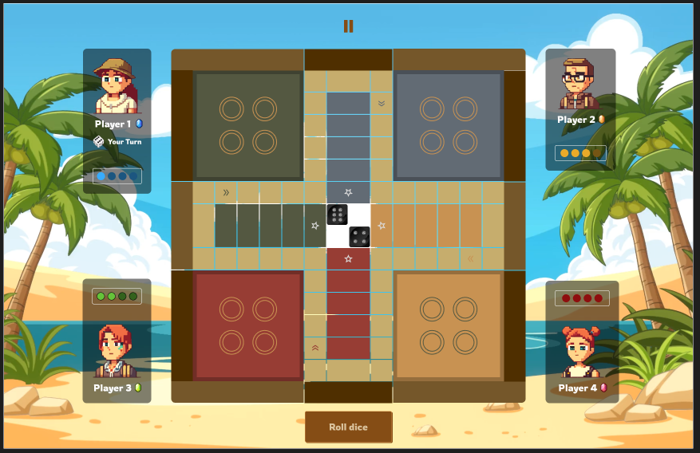
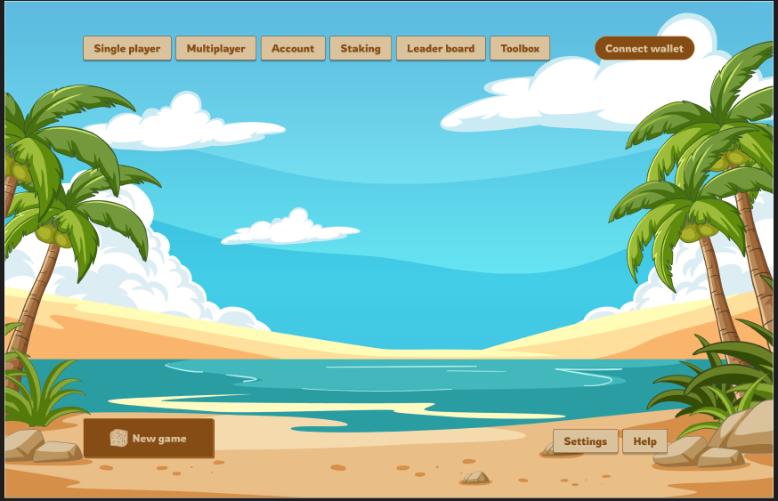
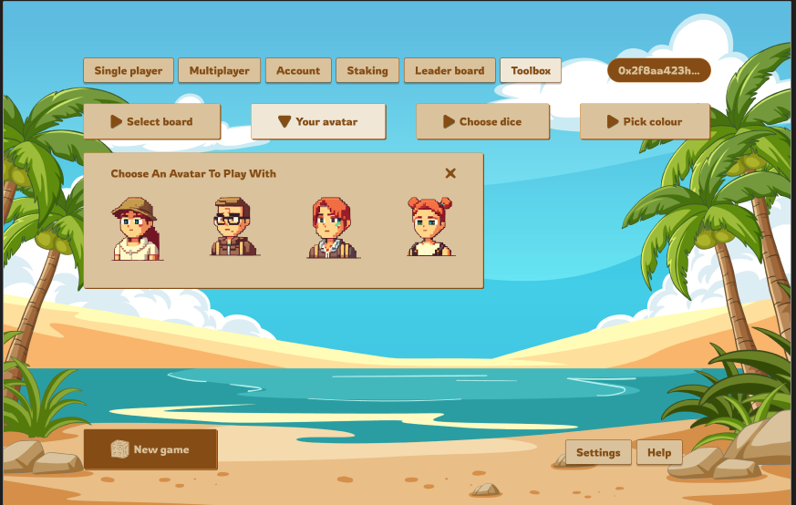
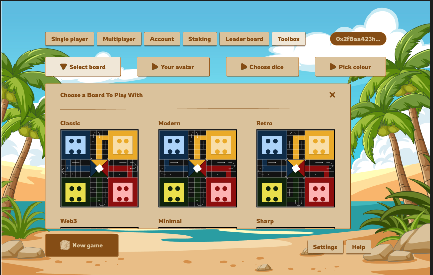
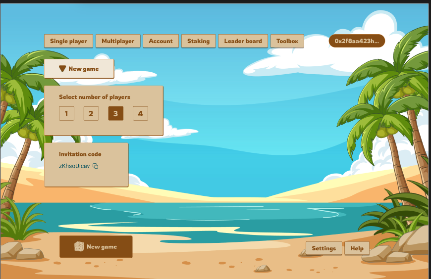
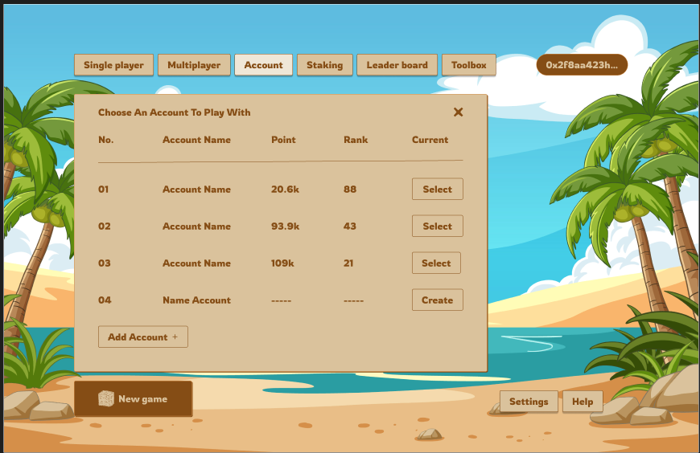
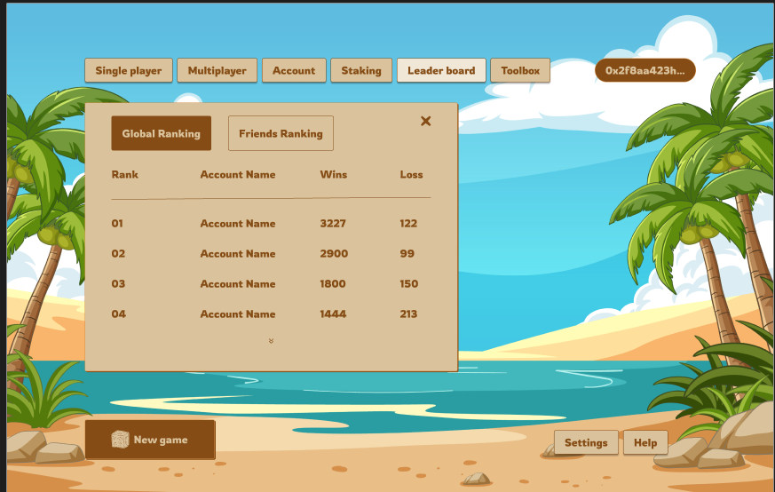
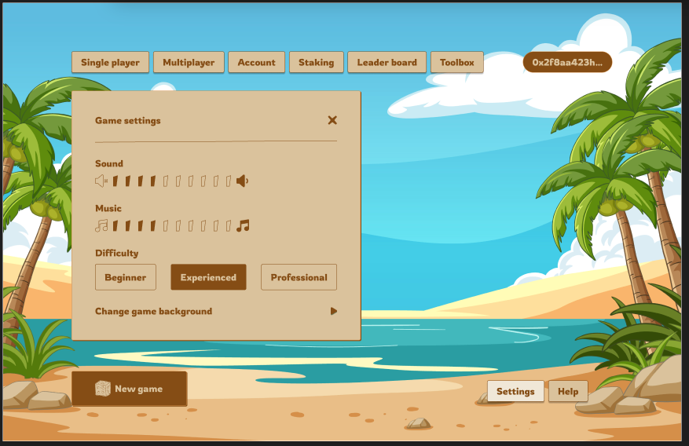

<h1 style="text-align: center">StarkLudo</h1>

_<div style="text-align: center">Ludo game, on Starknet</div>_

<div style="text-align: center ">
  
</div>

<div style="width: 100%; display: flex; align-items: center; justify-content: center">
<table >
  <tr>
  </tr>
  <tr>
    <td>Website</td>
    <td><a href="https://starkludo.com">https://starkludo.com</a></td>
  </tr>
  <tr>
    <td>Documentation</td>
    <td><a href="https://book.starkludo.com">https://book.starkludo.com</a></td>
  </tr>
</table></div>

## What is StarkLudo?

StarkLudo is a classic board game enjoyed by people of all ages. It’s a game of chance and strategy, where players race their game pieces around the board to be the first to reach the finish spot.

At the start of the game, all players are assigned 4 pieces each. The goal is to move all four pieces to the finish spot through a specific route on the board. Each piece is moved one at a time. Each player takes turn rolling a die, and the output of rolling the die determines how many steps forward a piece can move. The first player that moves all their 4 pieces to the finish spot is declared the winner.

The game can be played by either 2, 3 or four people. In each game, there can only be one loser. For example, if the game is played by 4 people, the first 3 players to reach the finish spot are the winners. The player that reaches first gets the first position, the player that reaches second gets the second position, and the third gets the third position.


### How to play

#### Single player mode:

1. Launch the app
2. Connect Wallet
3. Choose resume a game or start a new game
4. Select number of players you want to use
5. Choose user account
6. Start game

#### Multiplayer mode:

1. Launch the app
2. Connect Wallet
3. Choose join a game or start a new game
4. Select number of players you want to use
5. You get an invitation code to invite another player
6. Customize your avatar theme color
7. Choose user account
8. Start game

### Screenshots










## Development

Steps to build and run StarkLudo locally

### Prerequisites

**_Ensure you have the prerequisites installed before proceeding.
Check [here](https://book.dojoengine.org/getting-started#prerequisites) for guide on how to install the prerequisites._**

**NB:** Make sure you have node and npm installed.
Run `node -v && npm -v` on the terminal to check if they are installed else install them.

```
$ node -v && npm -v
v22.12.0
10.9.0
```

### Install tools

1. [Install pnpm](https://pnpm.io/installation#using-npm)

```bash
npm install -g pnpm
```

2. [Install Dojo](https://book.dojoengine.org/getting-started#install-dojo-using-dojoup)

```bash
# Install dojoup
curl -L https://install.dojoengine.org | bash

# Install Dojo release
dojoup --version v1.0.5
```

### Build and run StarkLudo

### Onchain

Requires 2 terminals to run

> In both terminals, ensure you are in the `onchain` directory. You can navigate into the `onchain` directory by running this command from the root directory: `cd onchain`

- Terminal 1

```bash
# Start Katana
katana --dev --dev.no-fee  --http.cors_origins "*"
```

- Terminal 2

```bash
# Build contracts
sozo build

# Deploy contracts to Katana
sozo migrate

# Run Torii with World address generated from previous command
torii --world <WORLD ADDRESS> --http.cors_origins "*"
```

To locate the world address, scan through the output generated from running `sozo migrate`, locate the line similar to:

```
⛩️  Migration successful with world at address 0x0114263853155c7f3c4209d140a05b106d9ce7f64f75058e2b3ab81fc72cc372
```

### Run contract tests

Use the following command to run the tests for StarkLudo contracts

```bash
# Navigate to the contracts directory
cd onchain

# Run tests
sozo test
```

If you want to run a specific test by the test name, use this command:

```bash
sozo test -f test_contract_deployment
```

> `test_contract_deployment` above is the name of the specific function being tested

> **_For more information about testing, check [Dojo book](https://book.dojoengine.org/framework/testing)_**


### Client
> Please note that Katana and Torii servers needs to be up and running before the client server can run successfully

```bash
# Navigate to the client directory
cd client

# Install dependencies
pnpm i

# Run
pnpm dev
```

## License

This project is licensed under the MIT License. See [License](./LICENSE) for more information

## Contributing

For more info and guidance on contributing, join the contributors Telegram group: https://t.me/+hnjQooODZOA2M2Rk
